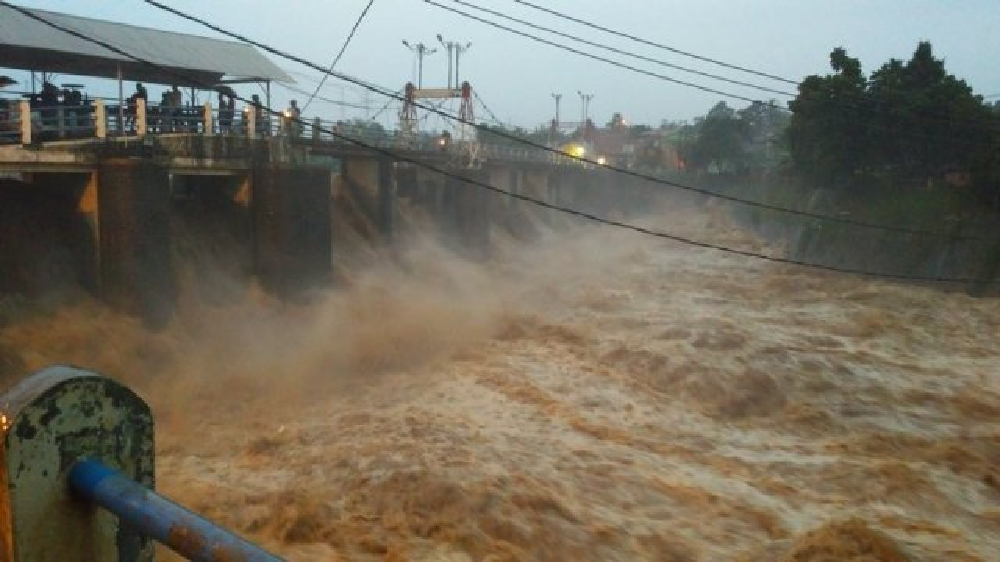

```{r setup, include=FALSE}
knitr::opts_chunk$set(echo = TRUE)
library(caret)
set.seed(2)
```

## Flood Detection Analysis

{width=250px}

## Background


Jakarta "flood" a.k.a flood has become somekind of a tradition, where flood can happen yearly and can go for over 2 weeks on every occurence

Research found that there are a few reasons for the flood: 

- high precipitation
- humidity level
- tide level
- land subsidence
- percipitation from neighboring area, based on the water level at Katulampa floodgate


## Problem Statement {.flexbox .vcenter}

Can we predict if flooding is going to happen given below conditions:

1. the weather data
2. Katulampa flood gate water level
3. Flood prediction based on One day before the flood of historical flood data

## Expected Result {.flexbox .vcenter}

To confirm using Random Forest Algorithm, if there is a statistical significance that we are able predict the flood before it happens, based on the weather data, Katulampa water level and H-1 of historical flood data

## Data Sources

* https://www7.ncdc.noaa.gov/CDO/cdoselect.cmd?datasetabbv=GSOD&countryabbv&georegionabbv (available data June 1968-June 2018)
* https://data.go.id/dataset/curah-hujan-dan-hari-hujan-menurut-bulan-dki-jakarta (January 2013-October 2016)
* https://bpbd.jakarta.go.id/waterlevel/ (April 2009-January 2014)
* http://data.jakarta.go.id/group/lingkungan-hidup

Period used: 2013-2016

## Data source from NOAA

Data source sample
```{r}
flood_data <- read.csv("data/CLEAN DATASET BANJIR.csv", stringsAsFactors = FALSE)
head(flood_data)
```

## Data source explanation
Breakdown of the data structure

CODE | Description
-----|-----
STN | Station number for the location.
YEARMODA | The year, month and day.
TEMP | Mean temperature for the day in degrees Fahrenheit to tenths.
DEWP | Mean dew point for the day in degrees Fahrenheit to tenths.
SLP | Mean sea level pressure for the day in millibars to tenths.

## Data source explanation

CODE | Description
-----|-----
STP | Mean station pressure for the day in millibars to tenths.
VISIB | Mean visibility for the day in miles to tenths.     
WDSP | Mean wind speed for the day in knots to tenths.
MXSPD | Maximum sustained wind speed reported for the day in knots to tenths.
GUST | Maximum wind gust reported for the day in knots to tenths.

## Data source explanation

CODE | Description
-----|-----
MAX | Maximum temperature reported during the day in Fahrenheit to tenths--time of max temp report varies by country and region, so this will sometimes not be the max for the calendar day.
MIN | Minimum temperature reported during the day in Fahrenheit to tenths--time of min  temp report varies by country and region, so this will sometimes not be the min for the calendar day. 
PRCP | Total precipitation (rain and/or melted snow) reported during the day in inches and hundredths.
SNDP | Snow depth in inches to tenths--last report for the day if reported more than once.
FRSHTT | Indicators for the occurrence during the day of: Fog ('F' - 1st digit). Rain or Drizzle ('R' - 2nd digit). Snow or Ice Pellets ('S' - 3rd digit). Hail ('H' - 4th digit). Thunder ('T' - 5th digit). Tornado or Funnel Cloud ('T' - 6th digit).


```{r, echo=FALSE}
flood_data$FACT1 <- factor(flood_data$FACT1, levels = c("0", "1"), labels = c("Normal", "Flood"))
flood_data$FACT2 <- factor(flood_data$FACT2, levels = c("0", "1"), labels = c("Normal", "H-1"))

flood_data$MXSPD <- as.numeric(flood_data$MXSPD)
flood_data$PRCP <- as.numeric(flood_data$PRCP)
```

## ETL the data
```{r}
summary(flood_data[,1:10])
```

## ETL the data
```{r}
summary(flood_data[,11:20])
```

## Facts about the data

Our source of data consist of flood (Flood) and Normal (no flooding)
```{r}
table(flood_data$FACT1)
min(flood_data$YEARMODA)
max(flood_data$YEARMODA)
```


## Data preparation

We remove unnecessary data (Station, date, another set of prediction, fog, snow and hail)
```{r}
flood_data <- subset(flood_data, select = -c(STN, YEARMODA, FACT2, FOG, SNOW, HAIL))
```

Also, we randomize from time series to avoid uneven spread data (sample() function)
```{r}

flood_data <- flood_data[sample(nrow(flood_data)),]

```


```{r, echo=FALSE}
# Creating a normalize() function, which takes a vector x and for each value in that vector, subtracts the minimum value in x and divides by the range of x

normalize <- function(x){
  return ( 
    (x - min(x))/(max(x) - min(x)) 
           )
}
```

## Data Preparation

We split the data into training data (80%) and test data (20%)
```{r}
flood_data_intrain <- sample(nrow(flood_data), nrow(flood_data)*0.8)
flood_data_train <- flood_data[flood_data_intrain, ]
flood_data_test <- flood_data[-flood_data_intrain, ]

```


```{r}
table(flood_data_train$FACT1)
prop.table(table(flood_data_train$FACT1))
table(flood_data_test$FACT1)
prop.table(table(flood_data_test$FACT1))
```

## Random forest function

Random forest implementation, with 4 mtry variables and 6 ntree variables
```{r}

rdsdata1 <- "data/randomforest1.rds"

# conditional. Remove rdsdata file to run this logic
if (!file.exists(rdsdata1)) {
   
  # Manual Search
  mtry_base <- sqrt(ncol(flood_data_train))
  seed <- 9
  metric <- "Accuracy"
  tunegrid <- expand.grid(.mtry=c(mtry_base ^ 0, mtry_base ^ 1, mtry_base * 2, mtry_base ^ 2))
  modellist1 <- list()
  repeats <- 10
  method <- "repeatedcv"
  
  for (ntree in c(25, 50, 100, 200, 500, 1000)) {
    control <- trainControl(method=method, number=10, repeats=repeats)
  	flood_forest_ntree <- train(FACT1~., data=flood_data_train, method="rf", metric=metric, tuneGrid=tunegrid, trControl=control, ntree=ntree)
  	key <- toString(ntree)
  	modellist1[[key]] <- flood_forest_ntree
  }
  saveRDS(modellist1, file = rdsdata1)

} else {
  modellist1 <-readRDS(rdsdata1)
}


#ctrl <- trainControl(method="repeatedcv", number=5, repeats=3)
#flood_data_forest <- train(FACT1 ~ ., data=flood_data_train, method="rf", trControl = ctrl)
```

## What is Mtry and ntree

### Mtry

Number of variables randomly sampled as candidates at each split. 

### Ntree

Number of trees to grow.


## Result of the Random Forest Tests

```{r}
results <- resamples(modellist1)

summary(results)
```

## Plotting the result


Bigger Kappa is better. The Kappa is below 20%, so it's safe to say that the quality of accuracy is not good enough
```{r}
dotplot(results)

```

From the graph, we use 200 trees as it give us better Kappa
```{r}
flood_data_forest <- modellist1$`200`
```

## Understanding Kappa

The Kappa statistic (or value) is a metric that compares an Observed Accuracy with an Expected Accuracy (random chance).

Kappa = (observed accuracy - expected accuracy)/(1 - expected accuracy)

* <0 as indicating no agreement
* 0.00–0.20 as slight, 
* 0.21–0.40 as fair, 
* 0.41–0.60 as moderate, 
* 0.61–0.80 as substantial, and 
* 0.81–1 as almost perfect agreement. 

## Random forest

Result of the random forest function
```{r}
flood_data_forest
```


## Prediction based on the formula

We try to see the result of the prediction
```{r}
flood_rf <- table(predict(flood_data_forest, flood_data_test[,-14]), flood_data_test[,14])
summary(flood_data_test[14])
flood_rf
```


Accuracy is:
```{r}
(flood_rf["Normal", "Normal"] + flood_rf["Flood", "Flood"]) / sum(flood_rf)
```

## What if we add Flood Gate Data

We found data of water level in the Katulampa water gate

{width=250px}

```{r}
flood_data <- read.csv("data/CLEAN DATASET BANJIR2.csv", stringsAsFactors = FALSE)
```


```{r}
summary(flood_data)
```

```{r, echo=FALSE}
flood_data$FACT1 <- factor(flood_data$FACT1, levels = c("0", "1"), labels = c("Normal", "Flood"))
flood_data$FACT2 <- factor(flood_data$FACT2, levels = c("0", "1"), labels = c("Normal", "H-1"))

flood_data$MXSPD <- as.numeric(flood_data$MXSPD)
flood_data$PRCP <- as.numeric(flood_data$PRCP)
```

## ETL the data
```{r}
summary(flood_data[ ,19:20])
```

## Total source data comparison

Our source of data consist of flood (Flood) and Normal (no flooding). We have fewer data because the water level is only available for January 2013-February 2014
```{r}
table(flood_data$FACT1)
```


```{r, echo=FALSE}
flood_data <- subset(flood_data, select = -c(STN, YEARMODA, FACT2, FOG, SNOW, HAIL))
```


```{r,  echo=FALSE}

flood_data <- flood_data[sample(nrow(flood_data)),]

```


```{r, echo=FALSE}
# Creating a normalize() function, which takes a vector x and for each value in that vector, subtracts the minimum value in x and divides by the range of x

normalize <- function(x){
  return ( 
    (x - min(x))/(max(x) - min(x)) 
           )
}
```


```{r,  echo=FALSE}
#flood_data_n <- as.data.frame(lapply(flood_data[,1:13], normalize))

#flood_data_x <- merge(flood_data_n, flood_data$FACT1, by="")
# n0_var <- nearZeroVar(flood_data[,1:14])
# flood_data <- flood_data[,-n0_var]

flood_data_intrain <- sample(nrow(flood_data), nrow(flood_data)*0.8)
flood_data_train <- flood_data[flood_data_intrain, ]
flood_data_test <- flood_data[-flood_data_intrain, ]

```

```{r, echo=FALSE}
prop.table(table(flood_data_train$FACT1))

prop.table(table(flood_data_test$FACT1))
```

## Random forest function

We run the same random forest, with 4 variation of mtry and 6 variation of ntree
```{r}

rdsdata2 <- "data/randomforest2.rds"

# conditional. Remove rdsdata file to run this logic
if (!file.exists(rdsdata2)) {
   
  # Manual Search
  mtry_base <- sqrt(ncol(flood_data_train))
  seed <- 9
  metric <- "Accuracy"
  tunegrid <- expand.grid(.mtry=c(mtry_base ^ 0, mtry_base ^ 1, mtry_base * 2, mtry_base ^ 2))
  modellist2 <- list()
  repeats <- 10
  method <- "repeatedcv"
  
  for (ntree in c(25, 50, 100, 200, 500, 1000)) {
    control <- trainControl(method=method, number=10, repeats=repeats)
  	flood_forest_ntree <- train(FACT1~., data=flood_data_train, method="rf", metric=metric, tuneGrid=tunegrid, trControl=control, ntree=ntree)
  	key <- toString(ntree)
  	modellist2[[key]] <- flood_forest_ntree
  }
  saveRDS(modellist2, file = rdsdata2)

} else {
  modellist2 <-readRDS(rdsdata2)
}


#ctrl <- trainControl(method="repeatedcv", number=5, repeats=3)
#flood_data_forest <- train(FACT1 ~ ., data=flood_data_train, method="rf", trControl = ctrl)
```

## Result of Random Forest

```{r}
results <- resamples(modellist2)

summary(results)
```

## Plot data of the test

We decided to choose 200 tree instead of 100 tree because the Kappa performance is really well

Kappa: https://stats.stackexchange.com/a/82187
```{r}
dotplot(results)

```


```{r}
flood_data_forest <- modellist2$`50`
```

## Random forest test result

Result of the random forest function
```{r}
flood_data_forest
```


## Prediction based on the formula

We try to see the result of the prediction
```{r}
flood_rf <- table(predict(flood_data_forest, flood_data_test[,-15]), flood_data_test[,15])
flood_rf
```


Accuracy is:
```{r}
(flood_rf["Normal", "Normal"] + flood_rf["Flood", "Flood"]) / sum(flood_rf)
```

## Conclusion

From this data, the effect of adding Katulampa flood gate data is essential for the accuracy of the prediction

```{r}

```

## How about predicting 1 Day before?


```{r}
flood_data <- read.csv("data/CLEAN DATASET BANJIR2.csv", stringsAsFactors = FALSE)
head(flood_data[,19:21], 20)
```

```{r, echo=FALSE}
flood_data$FACT1 <- factor(flood_data$FACT1, levels = c("0", "1"), labels = c("Normal", "Flood"))
flood_data$FACT2 <- factor(flood_data$FACT2, levels = c("0", "1"), labels = c("Normal", "H-1"))

flood_data$MXSPD <- as.numeric(flood_data$MXSPD)
flood_data$PRCP <- as.numeric(flood_data$PRCP)
```

## ETL the data
```{r}
summary(flood_data[ ,19:21])
```

## Total source data comparison

Our source of data consist of *one day before flood* (H-1) and *Normal* (no flooding). We have fewer data because the water level is only available for January 2013-February 2014
```{r}
table(flood_data$FACT2)
```


```{r, echo=FALSE}
flood_data <- subset(flood_data, select = -c(STN, YEARMODA, FACT1, FOG, SNOW, HAIL))
```


```{r,  echo=FALSE}

flood_data <- flood_data[sample(nrow(flood_data)),]

```


```{r, echo=FALSE}
# Creating a normalize() function, which takes a vector x and for each value in that vector, subtracts the minimum value in x and divides by the range of x

normalize <- function(x){
  return ( 
    (x - min(x))/(max(x) - min(x)) 
           )
}
```


```{r,  echo=FALSE}
#flood_data_n <- as.data.frame(lapply(flood_data[,1:13], normalize))

#flood_data_x <- merge(flood_data_n, flood_data$FACT1, by="")
# n0_var <- nearZeroVar(flood_data[,1:14])
# flood_data <- flood_data[,-n0_var]

flood_data_intrain <- sample(nrow(flood_data), nrow(flood_data)*0.8)
flood_data_train <- flood_data[flood_data_intrain, ]
flood_data_test <- flood_data[-flood_data_intrain, ]

```

```{r, echo=FALSE}
prop.table(table(flood_data_train$FACT2))

prop.table(table(flood_data_test$FACT2))
```

## Random forest function

We run the same random forest, with 4 variation of mtry and 6 variation of ntree
```{r}

rdsdata3 <- "data/randomforest3.rds"

# conditional. Remove rdsdata file to run this logic
if (!file.exists(rdsdata3)) {
   
  # Manual Search
  mtry_base <- sqrt(ncol(flood_data_train))
  seed <- 9
  metric <- "Accuracy"
  tunegrid <- expand.grid(.mtry=c(mtry_base ^ 0, mtry_base ^ 1, mtry_base * 2, mtry_base ^ 2))
  modellist3 <- list()
  repeats <- 10
  method <- "repeatedcv"
  
  for (ntree in c(25, 50, 100, 200, 500, 1000)) {
    control <- trainControl(method=method, number=10, repeats=repeats)
  	flood_forest_ntree <- train(FACT2~., data=flood_data_train, method="rf", metric=metric, tuneGrid=tunegrid, trControl=control, ntree=ntree)
  	key <- toString(ntree)
  	modellist3[[key]] <- flood_forest_ntree
  }
  saveRDS(modellist3, file = rdsdata3)

} else {
  modellist3 <-readRDS(rdsdata3)
}


#ctrl <- trainControl(method="repeatedcv", number=5, repeats=3)
#flood_data_forest <- train(FACT1 ~ ., data=flood_data_train, method="rf", trControl = ctrl)
```

## Result of Random Forest

```{r}
results <- resamples(modellist3)

summary(results)
```

## Plot data of the test

We use the 1000 ntree result because the Kappa is the best
```{r}
flood_data_forest <- modellist3$`1000`
```
```{r}
dotplot(results)

```


## Random forest test result

Result of the random forest function. You can see that the Kappa is very bad (around zero). The information here is useless.
```{r}
flood_data_forest
```


## Prediction based on the formula

We try to see the result of the prediction


```{r}
summary(flood_data_test[14:15])
```

## Prediction based on the formula

We try to see the result of the prediction

```{r}
flood_rf <- table(predict(flood_data_forest, flood_data_test[,-15]), flood_data_test[,15])
flood_rf
```


Accuracy is:
```{r}
(flood_rf["Normal", "Normal"] + flood_rf["H-1", "H-1"]) / sum(flood_rf)
```

## Conclusion

The result is inconclusive. We think that the lack amount of data doesn't help either. Kappa is below 0.10, and even negative 0.00, thus indicating that the confidence level is really bad. We can't use this result.
